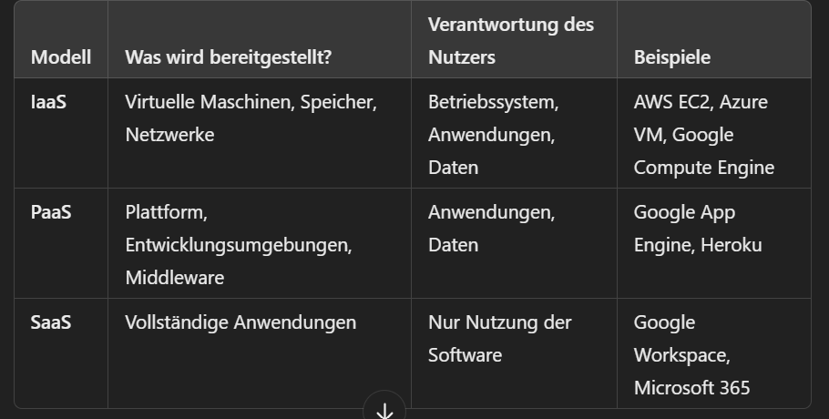

Wie ist der Begriff Cloud entstanden? Wieso heisst es Cloud?
Da frühere Netzwerkdiagramme (70er, 80er) oftmals in so einer Wolkenform dargestellt wurden, wurde der Begriff Wolke (Cloud) verwendet. Die "Wolke" wurde auch als Metapha für das Internet verwendet.

Wie wird der Begriff Cloud definiert, z.B. gemäss NIST?
Sie defninieren Cloud als ein Modell, dass jeden ermöglicht von überall zu jeder zeit
auf Ressourcen zuzugreifen.

Welches sind die 5 Merkmale einer Cloud?
On-Demand Self-Service, breiter Netzwerkzugang, Ressourcen-Pooling, schnelle Elastizität und messbare Dienste

Welche Cloud Dienstleistungen kennen Sie?
Onedrive, AWS, Docker

Welche Cloud Anbieter kennen Sie?
Microsoft, Amazon

Welche Cloud Deployment Modelle kennen Sie?
Public Cloud, Private Cloud, Hybrid Cloud, Community Cloud

Was sind Cloud Service Modelle?

Cloud-Service-Modelle beschreiben verschiedene Arten von Diensten, die über die Cloud bereitgestellt werden. Sie definieren, welche Komponenten vom Anbieter verwaltet werden und welche vom Nutzer selbst. Es gibt drei Haupt-Service-Modelle, die jeweils unterschiedliche Verantwortlichkeiten und Anwendungsfälle haben:

Weshalb soll ich Dienste aus der Cloud beziehen? Was sind die Vorteile?
1. Kosteneinsparung: Man selber hat keine Anschaffungs oder Wartungs kosten, da sich
der Anbiter der Cloud um das kümmert. Man kann die Ressourcen auf seinen Bedarf skalieren, womit keine unnötigen Ressourcen verschwendet werden.

2. Fokus auf das Kerngeschäft
Unternehmen können sich auf ihre Kernkompetenzen konzentrieren, anstatt sich mit der Verwaltung von IT-Infrastruktur zu beschäftigen.
IT-Entlastung: IT-Teams müssen weniger Zeit für Infrastruktur und Wartung aufwenden und können sich auf strategischere Aufgaben konzentrieren.

Was sind die Nachteile?
Welche Dienstleistungen werden in Ihrem Betrieb On-Premise (eigenes Rechenzentrum) betrieben?
Wie werden technologische Beiträge in der Cloud geteilt bzw. zur Verfügung gestellt?