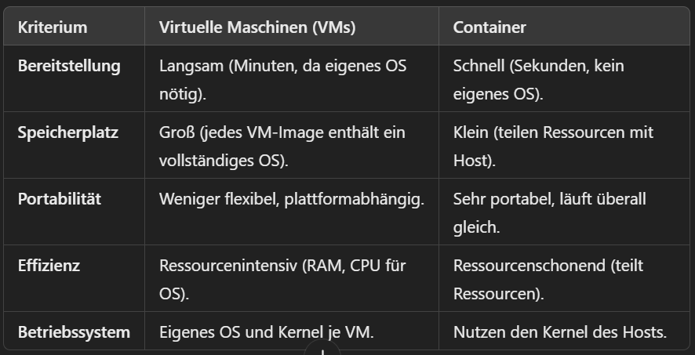

Was ist Container-Technologie oder Container-Virtualisierung?
Container in der IT sind isolierte, portable Umgebungen, die eine Anwendung und ihre Abhängigkeiten bündeln. Sie ermöglichen es, Software effizient und konsistent auf verschiedenen Systemen auszuführen, ohne dass eine vollständige virtuelle Maschine benötigt wird. Container nutzen den Host-Betriebssystem-Kernel und sind ressourcenschonend und schnell.

Was sind die Vor- und Nachteile der Container-Technologie zu virtuellen Servern (VM)?
Vorteile:
Isolierung: Container laufen unabhängig voneinander.
Portabilität: Container können problemlos zwischen verschiedenen Umgebungen bewegt werden.
Effizienz: Geringerer Ressourcenverbrauch im Vergleich zu virtuellen Maschinen.

Nachteile:
Sicherheitsrisiken: Container teilen sich den gleichen Betriebssystem-Kernel, was zu Sicherheitsproblemen führen kann, wenn ein Container kompromittiert wird.

Komplexität: Die Verwaltung vieler Container kann schwierig sein, besonders ohne Tools wie Kubernetes.

Eingeschränkte Unterstützung für Legacy-Software: Alte Anwendungen sind schwer in Container zu integrieren.

Datenpersistenz: Container verlieren ihre Daten bei Neustart, was das Speichern von persistenten Daten erschwert.

Leistungsprobleme: Die Kommunikation zwischen Containern kann zusätzliche Netzwerkressourcen verbrauchen und die Leistung beeinträchtigen.

Welche Produkte kennen Sie im Zusammenhang mit virtuellen Servern und Container?
Container: Docker und Kubernetes
Server: VMVare und OracleVirtualBox

Wie unterscheiden sich die Technologien VM und Container in Bezug auf Bereitstellung, Speicherplatz, Portabilität, Effizienz und Betriebssystem (Kernel)?

Können virtuelle Server immer durch Container ersetzt werden?
Unterschiedliche Betriebssysteme: Container nutzen den Host-Kernel, VMs können verschiedene OS parallel ausführen.
Höhere Sicherheit: VMs bieten bessere Isolation durch eigenes Betriebssystem.
Legacy-Software: Alte Anwendungen laufen oft besser auf VMs.
Langfristige Speicherung: Container sind flüchtig, VMs stabiler für dauerhafte Daten.

Was ist unterschied zwischen Self-Managed und Fully Managed? Notieren Sie sich die wichtigsten Merkmale und diskutieren Sie die Ergebnisse in der Gruppe.

Container:
Self-Managed:

Du installierst und verwaltest Tools wie Docker oder Kubernetes selbst.
Du kümmerst dich um Updates, Fehlerbehebung, Skalierung und Sicherheit.
Beispiel: Du setzt Kubernetes on-premises oder in einer Cloud auf und verwaltest alles eigenständig.
Fully Managed:

Ein Anbieter übernimmt die Verwaltung für dich. Du nutzt den Service einfach.
Beispiele: AWS Elastic Kubernetes Service (EKS), Google Kubernetes Engine (GKE) oder Azure Kubernetes Service (AKS).
Vorteile: Du musst dich nicht um die Installation oder den Betrieb kümmern, sondern kannst direkt Container deployen.
2. Virtuelle Maschinen (VMs):
Self-Managed:

Du richtest VMs auf deinem eigenen Server oder in der Cloud ein und verwaltest sie selbst.
Du bist für die Betriebssystem-Updates, Sicherheit und Leistung verantwortlich.
Beispiel: Du betreibst einen VMware-Cluster oder erstellst VMs in AWS ohne zusätzliche Management-Dienste.
Fully Managed:

Der Anbieter stellt vorkonfigurierte, verwaltete VMs bereit.
Beispiele: AWS Lightsail, Azure Virtual Machines mit Management-Diensten.
Vorteile: Automatische Updates, einfache Skalierung und weniger Aufwand für Wartung.
